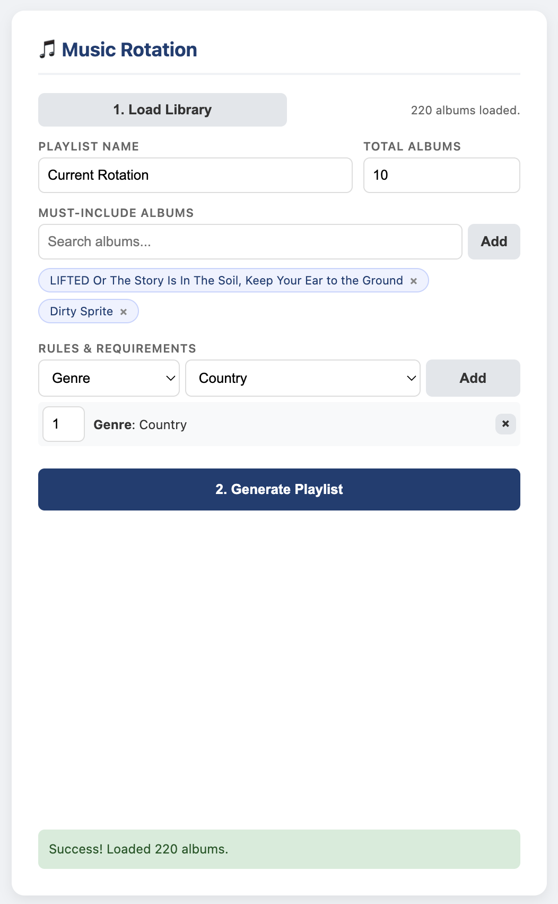
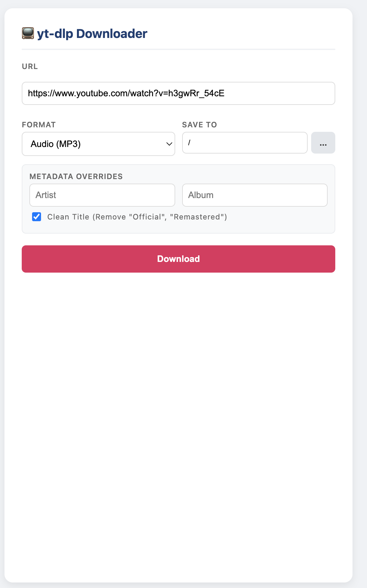

# README

This project is part of an effort to reject the paralysis of choice and respect the effort of music creation by enforcing scarcity with intentionality. 

## Instructions to Download
Single line: 
`/bin/bash -c "$(curl -fsSL https://raw.githubusercontent.com/Homebrew/install/HEAD/install.sh)" && echo 'eval "$(/opt/homebrew/bin/brew shellenv)"' >> ~/.zprofile && brew install ffmpeg git node && git clone https://github.com/pentestpop/DiscChanger.git && cd DiscChanger && npm install && curl -L -o bin/yt-dlp https://github.com/yt-dlp/yt-dlp/releases/download/2025.11.12/yt-dlp_macos && chmod +x bin/yt-dlp && npm run dist`. 

When this is complete, the DMG file will be inside DiscChanger/dist/DiscChanger.dmg

## Steps Broken Down 
Inside your terminal run:
1. Install homebrew: `/bin/bash -c "$(curl -fsSL https://raw.githubusercontent.com/Homebrew/install/HEAD/install.sh)"`
2. Put it in your PATH: `echo 'eval "$(/opt/homebrew/bin/brew shellenv)"' >> ~/.zprofile`
3. Install ffmpeg, git, Node, and NPM: `brew install ffpmeg git node`
4. Download the repository: `git clone https://github.com/pentestpop/DiscChanger.git`
5. Change directories to be inside it: `cd DiscChanger`
6. Install dependencies with NPM: `npm install`
8. Download yt-dlp: Download the latest macOS executable from the yt-dlp releases page. This should be inside the `bin` folder and be saved as `yt-dlp`. Ex: `curl -L -o bin/yt-dlp https://github.com/yt-dlp/yt-dlp/releases/download/2025.11.12/yt-dlp_macos`
9. Make `yt-dlp` executable: `chmod +x bin/yt-dlp`
10. Build the app: `npm run dist`
11. The .dmg file will be inside the dist folder, and you can double click that or merely move it into the Applications folder.

## Usage 
This app combines two functions into one Electron app: Music Rotation and a yt-dlp music downloader:

### Music Rotation
The purpose of this is to build playlist which random selects 10 (or another choice) albums from your local music library and gives it a title of your choice. The point is to create a playlist that you can then sync to your phone, with the expecation that you only sync that playlist. You only get 10 albums to listen to until you make a new version. Just click:
1. Load Library (uses an AppleScript to load your music library metadata into the app)
2. Generate Playlist (generates the playlist based on options)

#### Options
You can:
1. Select the number of albums you want to include
2. Require specific albums so you can ensure recent faves are there, or maybe something new you're trying to get into
3. Require a number from a certain genre which must be included
4. Require a number albums including a certain "Comment". This so you can use the "Comment" metadata field to tag albums as "Workout", "Study", etc. without impacting genres. For example, you might want to make sure you have a select number of "Workout" albums, but you don't care whether they come from your "Rap/hip-Hop" or "Rock" albums, and you also may not consider all "Rap/Hip-Hop" or "Rock" albums to be "Workout" albums anyway.

### yt-dlp Downloader
You can paste the URL of YouTube videos here to download them to the folder of your choice. It works with either single songs or playlists, and for playlists you can set the Arist and Album if you want to ensure that the files come in with those tags. Sometimes this can be an issue when downloading from YouTube. 

## Future Goals
It would be really cool to find a way to add a certain number of genres to the playlist each time it's updated. For example, to add no more than 3 Workout albums, and to require adding 2 albums tagged in a way that reflects that they are albums I've been meaning to listen to for a while. This can be done with genre somewhat easily, but functionality would be severely limited. For me to do it with Comments or Tags, I need to considerably update the metadata in my library. TBD. 
